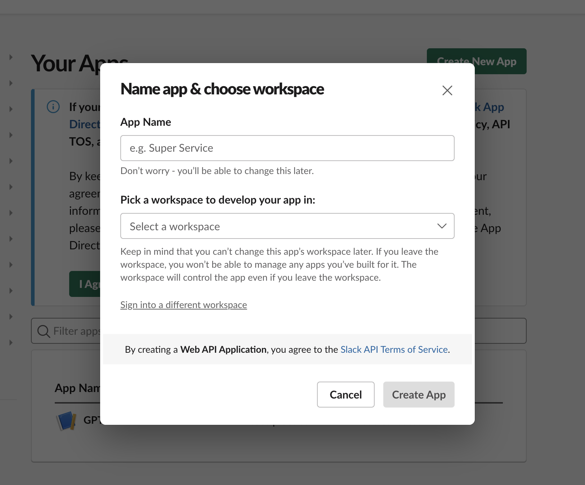
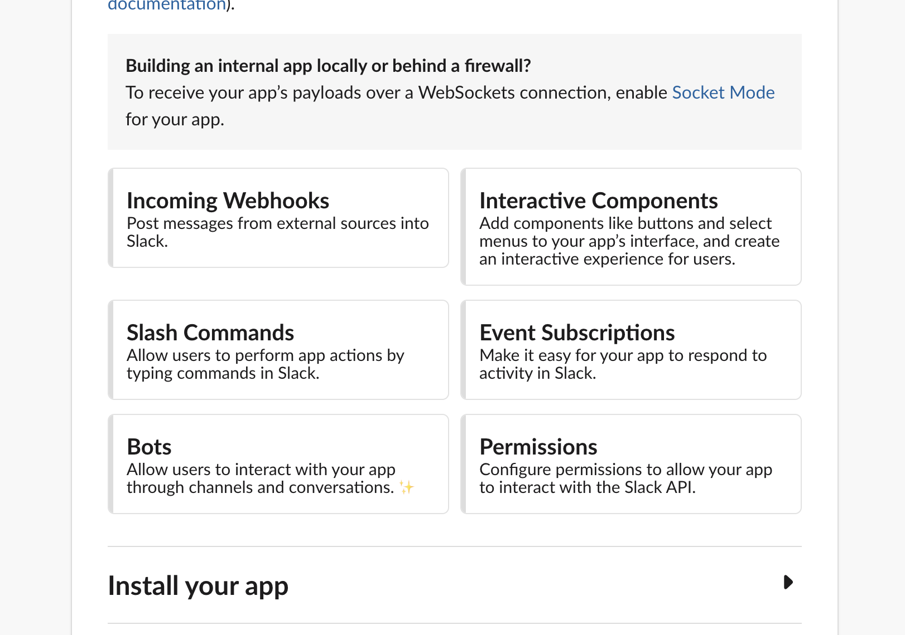

# Slackで出欠確認
対象コード: [atendance.js](../../src//slack//attendance.js)

## 仕様
slackのスラッシュコマンド`/attendance`を打つと出欠確認できるようになります。  
チャンネル内の各メンバーが`参加`を押下すると出席が確認できます。

<!-- ## 作成方法
- [slack appの設定](#slack-appの設定)
- [スラッシュコマンドの作成](#スラッシュコマンドの作成)
- [参加ボタン用APIの作成](#参加ボタン用APIの作成) -->

## slack appの設定
[Slack API](https://api.slack.com/)へアクセスします。  
`Create New App`でAppを作成します。`From scratch`を選択すると下記のモーダルが出てくるのでApp Nameと使用するワークスペースを選択してください。  

`Create App`を押下したら作成されます。

次にBotの登録を行います。  
モーダルを閉じた画面でAdd Features and Functionalityを開き下記の[Bots](#app-homeの設定)、[Permissions](#oauth--permissionsの設定)を設定してください。

### OAuth & Permissionsの設定
Scopeを設定します。

### App Homeの設定
`Your App's Presence in Slack`セクションのEditボタンでDisplay NameとDefault Nameを設定します。

## アプリのインストールとtokenの確認
設定できたらアプリのインストールとtokenの確認を行います。  
`Basic Information`の`Install to Workspace`でワークスペースにアプリをインストールします。

## 参考サイト
- [【出欠確認に疲れた若手必見】 3ステップでできる! slackで出欠確認コマンド](https://qiita.com/haruka_odenkun/items/1bade2b404bbcb6cfec5)
- [【GAS×SlackAPI】ワークスペースのユーザー名とIDをスプレッドシートに取得する
](https://moripro.net/gas-slackapi-get-user-id/)